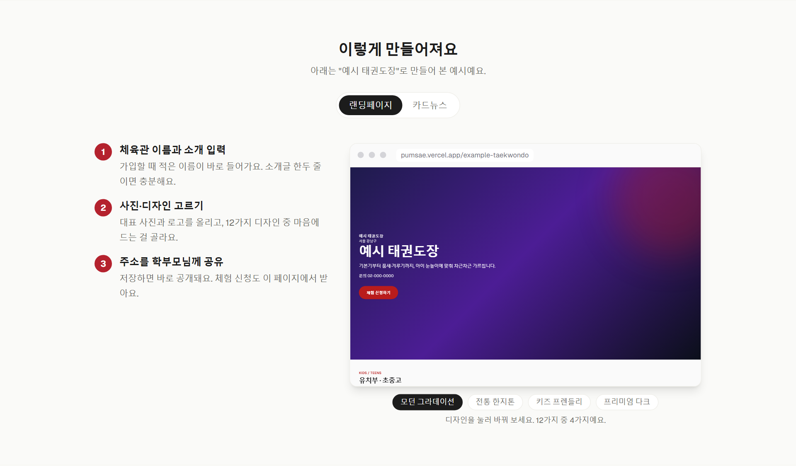
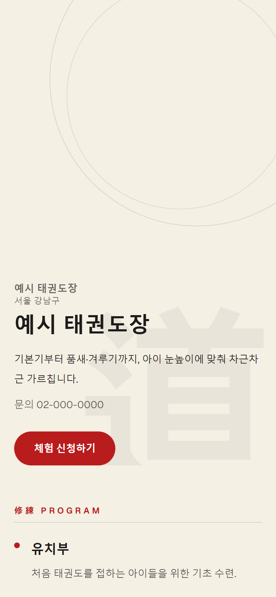
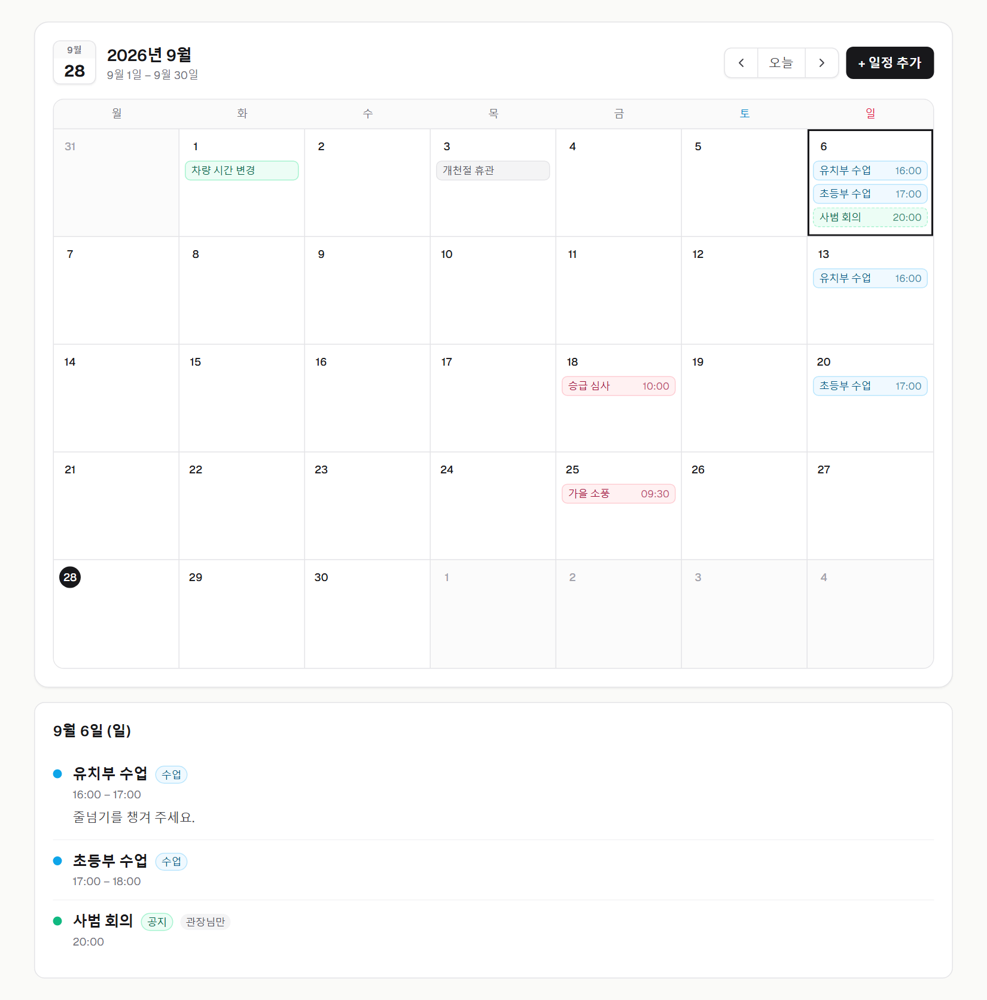
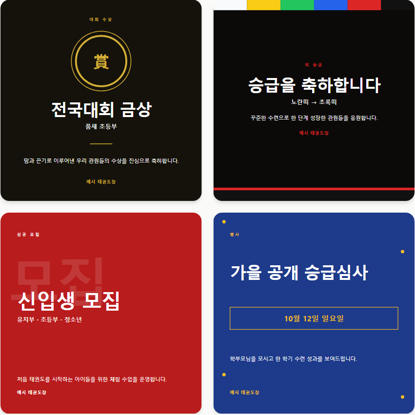
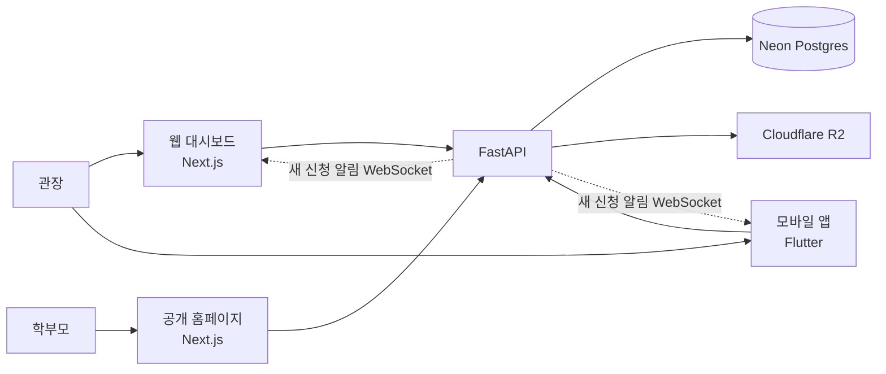

# PUMSAE

**태권도장 관장님이 도장 홈페이지를 만들고, 홍보 카드뉴스를 제작하고, 학부모의 체험 신청을 실시간으로 받는 서비스**

웹(공개 홈페이지·관장 대시보드), 모바일 앱, API 서버로 이루어져 있고 모두 운영 배포 중입니다.

- 서비스: https://pumsae.vercel.app
- 문서: [프로젝트 계획서](./docs/PUMSAE_프로젝트_계획서.md) · [데이터 ERD](./docs/erd.md) · [배포 가이드](./docs/배포.md)



---

## 화면

| 공개 홈페이지 (휴대폰) | 캘린더 (관장 대시보드) |
|---|---|
|  |  |

**카드뉴스** — 대회 수상, 띠 승급, 신규 모집, 행사 4종을 문구만 바꿔 고화질 이미지로 저장합니다.



> 화면은 모두 설명용 "예시 태권도장" 데이터로 찍었습니다.

---

## 주요 기능

**공개 홈페이지** (`pumsae.vercel.app/{도장주소}`, 학부모는 로그인 없이 이용)

- 디자인 12종과 제목 글꼴 10종. 대표 사진은 끌어서 위치·확대, 로고는 페이지 어디든 이동·크기 조절
- 도장 주소를 직접 정하고, 주소를 바꿔도 예전 링크는 새 주소로 영구 이동(308)
- 우리 도장 소식(공개로 고른 카드뉴스), 사진첩(공개 앨범), 수업·행사 일정과 "이번 달 안내"
- 체험 신청서. 제출하면 관장님 화면에 바로 알림

**관장 대시보드** (웹, 휴대폰에서는 ☰ 메뉴)

- 내 작업물: 홈페이지 미리보기·주소 복사, 최근 카드뉴스와 체험 신청을 한 화면에
- 랜딩페이지 편집기: 입력하면 오른쪽 미리보기에 바로 반영, 글자 더블클릭 수정
- 카드뉴스, 사진첩(여러 장 한 번에 업로드), 캘린더(수업·행사·휴관·공지), 체험 신청 관리

**모바일 앱** (Flutter)

- 내 작업물, 캘린더, 사진첩(갤러리 여러 장 선택·카메라 촬영), 카드뉴스 갤러리 저장, 체험 신청 실시간 수신

---

## 기술 스택

| 영역 | 기술 |
|---|---|
| 웹 | Next.js 14 (App Router), TypeScript, Tailwind CSS · Vercel |
| 모바일 앱 | Flutter, Riverpod, go_router, Dio |
| API 서버 | FastAPI, Pydantic · Railway (Docker) |
| 데이터베이스 | Neon Postgres, SQLAlchemy 2, Alembic (배포 시 자동 마이그레이션) |
| 파일 | Cloudflare R2 (Pillow로 회전 보정·리사이즈 후 webp 저장) |
| 실시간 | WebSocket |
| 이미지 생성 | Playwright (카드뉴스 고화질 PNG) |
| 인증 | 자체 JWT — access token은 메모리, refresh token은 httpOnly 쿠키 |
| CI | GitHub Actions (백엔드 Docker 이미지 빌드) |



프론트와 앱은 DB나 파일 저장소에 직접 접근하지 않고, 모든 조회·저장·업로드가 API 서버를 거칩니다. 권한은 DB의 RLS 대신 API에서 `current_user.dojang_id`로 검사합니다.

---

## 해결한 문제

**1. 배포 환경에서만 새로고침하면 로그인이 풀림**
- 원인: 웹(Vercel)과 API(Railway)가 서로 다른 사이트라, `SameSite=Lax`인 refresh 쿠키가 교차 사이트 fetch에 실리지 않았습니다. 로컬은 같은 사이트(localhost)라 재현되지 않았습니다.
- 해결: HTTPS 환경에서는 쿠키를 `SameSite=None; Secure`로 발급하도록 바꿨습니다.

**2. 저장이 CORS 에러로 실패**
- 원인: 브라우저에는 CORS 에러로 보였지만, 실제로는 서버가 500을 내면서 CORS 헤더가 빠진 응답이었습니다. 서버 로그를 보니 새 컬럼(`logo_position`)의 마이그레이션이 운영 DB에 적용되지 않은 채 새 코드가 배포되어 있었습니다.
- 해결: preflight 요청과 서버 로그로 CORS 설정 문제가 아님을 먼저 확인했습니다. 그다음 마이그레이션을 적용하고, 시작 명령을 `railway.toml`로 옮겨 배포할 때마다 마이그레이션이 먼저 돌도록 했습니다.

**3. 휴대폰 사진이 옆으로 누워 보이고 페이지가 무거움**
- 원인: 휴대폰 사진은 회전 정보를 EXIF에 따로 담고, 원본이 4000px 이상입니다.
- 해결: 업로드 시 서버에서 EXIF 회전을 적용한 뒤 긴 변 2048px(보기용)·480px(목록용) 두 벌의 webp로 저장합니다. 앱은 기기에서 한 번 더 줄여 전송량을 줄입니다.

**4. 주소를 바꾸면 이미 공유한 링크가 끊김**
- 해결: 이전 주소를 별도 테이블에 남기고, 공개 조회가 예전 주소도 찾아 현재 주소로 영구 이동(308)시킵니다. 새로 가입하는 도장에는 다른 도장의 예전 주소가 배정되지 않게 했습니다.

**5. 로그인 토큰이 서버 로그에 그대로 남음**
- 원인: WebSocket을 `?token=` 쿼리로 인증해, 접속 로그에 access token이 찍혔습니다.
- 해결: 토큰을 연결 후 첫 메시지로 보내도록 웹·앱을 바꾸고, 예전 앱 버전을 위해 로그에서 `token=` 값을 가립니다. 정상 로그(INFO)는 stdout, 경고 이상만 stderr로 나눠 에러가 묻히지 않게 했습니다.

**6. 느린 휴대폰에서 ☰ 메뉴가 열리자마자 닫힘**
- 원인: "페이지가 바뀌면 메뉴 닫기" 로직이, 이동이 끝나기 전에 다시 연 메뉴까지 닫았습니다.
- 해결: Playwright로 느린 네트워크를 흉내 내 재현한 뒤, 메뉴 항목 클릭·ESC·바깥 클릭·뒤로 가기에서만 닫도록 바꾸고 다섯 가지 경우를 확인했습니다.

**7. 편집기에서 고른 글꼴 5종이 저장되지 않음**
- 원인: 프론트는 글꼴 10종을 제공하는데 DB enum과 API는 5종만 알고 있었습니다.
- 해결: Postgres enum에 값을 추가하는 마이그레이션(트랜잭션 밖 실행)과 API 스키마를 맞췄습니다.

---

## 설계에서 신경 쓴 점

- **공개 범위는 항목마다 관장님이 정함:** 카드뉴스와 사진첩은 비공개로 시작하고, 캘린더는 공개로 시작합니다. 아이 얼굴이 담기는 사진첩은 초상권 안내 문구를 함께 보여줍니다.
- **공개 페이지는 읽기 전용:** 편집은 대시보드에서만 하고, 공개 페이지에는 편집 UI를 내보내지 않습니다.
- **같은 부품으로 그리기:** 공개 홈페이지, 편집기 미리보기, 서비스 홈의 예시, 공개 "소식"의 카드뉴스가 모두 같은 React 컴포넌트로 그려집니다. 예시 화면용 캡처 이미지를 따로 관리하지 않습니다.
- **휴대폰 먼저:** 대시보드는 좁은 화면에서 ☰ 메뉴, 캘린더는 칩 대신 색 점과 날짜별 다이어리로 바뀝니다.

---

## 폴더 구조

```
pumsae/
├── app/            # Next.js 라우트 (공개 홈페이지, 대시보드, 인증, 프로필)
├── components/     # 화면 부품 (landing, hero-layouts, calendar, albums, templates …)
├── lib/            # API 클라이언트와 유틸
├── types/
├── backend/        # FastAPI (api, models, core, promo) + Alembic
├── pumsae_app/     # Flutter 앱
└── docs/           # 계획서, ERD, 배포 가이드, 화면 캡처
```

---

## 로컬 실행

프론트 (저장소 루트):

```bash
copy .env.example .env.local
npm install
npm run dev
```

백엔드:

```bash
cd backend
copy .env.example .env
python -m venv .venv
.\.venv\Scripts\activate
pip install -r requirements.txt
playwright install chromium
alembic upgrade head
uvicorn app.main:app --reload --port 8000
```

앱:

```bash
cd pumsae_app
flutter pub get
flutter run
```

`backend/.env`의 `DATABASE_URL`은 Neon 연결 문자열입니다. 운영 배포는 [배포 가이드](./docs/배포.md)를 보세요.
