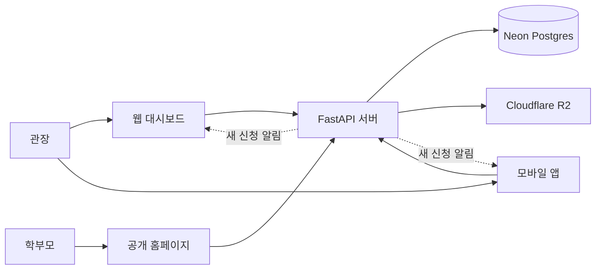

# PUMSAE — 프로젝트 계획서

> 지역 태권도장이 직접 홍보하고, 학부모와 소통하고, 체험 신청을 받는 플랫폼

관련 문서: [프로젝트 개요](./프로젝트.md) · [데이터 ERD](./erd.md) · [개발 가이드 v3](./PUMSAE_개발가이드_v3.md)

| 항목 | 내용 |
|---|---|
| 과제명 | PUMSAE (품새) |
| 작성일 | 2026-09-28 |
| 추진 기간 | 2026-09-08 ~ 진행 중 |
| 현재 상태 | 웹·앱·서버 운영 배포 중 |
| 구성 | 웹(공개 홈페이지·관장 대시보드), 모바일 앱, API 서버 |
| 개발 실적 | 커밋 53건 · DB 마이그레이션 15건 |

---

## 1. 과제 개요

PUMSAE는 태권도장·체육관 관장님이 **도장 전용 홈페이지**를 만들고, **홍보 카드뉴스**를 제작하고, **학부모의 체험 신청**을 실시간으로 받는 서비스입니다. 여러 도장을 모아 보여주는 검색형 서비스가 아니라, 도장마다 자기 주소를 가진 홈페이지를 제공합니다.

관장님은 웹 대시보드나 모바일 앱에서 관리하고, 학부모는 로그인 없이 도장 홈페이지에서 소식·사진·일정을 보고 체험을 신청합니다.

---

## 2. 추진 배경 및 필요성

- **홍보 수단의 부재:** 소규모 도장은 홈페이지를 만들거나 관리할 여력이 적고, 홍보가 전단지와 SNS 게시물에 흩어져 있습니다.
- **반복되는 홍보물 제작:** 대회 수상, 띠 승급, 신규 모집, 행사 소식은 자주 생기지만, 매번 디자인 도구로 이미지를 만드는 일은 번거롭습니다.
- **흩어진 학부모 소통:** 수업 일정, 휴관 안내, 행사 사진이 단톡방에 흘러가 나중에 찾기 어렵습니다.
- **신청 접수의 누락:** 전화·메시지로 받는 체험 문의는 기록이 남지 않거나 놓치기 쉽습니다.

> 위 내용은 서비스를 기획한 문제 인식이며, 별도의 설문·통계 자료를 근거로 한 것은 아닙니다.

---

## 3. 목표

처음 기획한 세 가지 핵심 기능을 먼저 갖추고, 사용해 본 피드백을 반영해 학부모 소통 기능을 넓혔습니다.

| 핵심 목표 | 내용 |
|---|---|
| 홍보 홈페이지 | 이름·소개·사진만 넣으면 도장 전용 주소의 홈페이지가 완성됩니다. |
| 카드뉴스 생성 | 수상·승급·모집·행사 카드를 편집해 고화질 이미지로 받습니다. |
| 체험 신청 접수 | 학부모는 로그인 없이 신청하고, 관장님 화면에 바로 알림이 뜹니다. |

**확장 목표 (피드백 반영):** 캘린더(수업·행사·휴관·안내), 사진첩, 도장 소식을 홈페이지에 모아 학부모가 한곳에서 확인하게 합니다. 모든 화면은 휴대폰에서 먼저 쓰기 편하도록 만듭니다.

---

## 4. 이용자

| 이용자 | 하는 일 | 이용 방법 | 상태 |
|---|---|---|---|
| 관장 | 홈페이지 편집, 카드뉴스·사진첩·캘린더 관리, 체험 신청 확인 | 웹 대시보드, 모바일 앱 | 운영 중 |
| 사범 | 같은 도장 소속으로 관리 기능 참여 | 웹 대시보드, 모바일 앱 | 합류 기능 예정 |
| 학부모 | 도장 홈페이지에서 소식·사진·일정 확인, 체험 신청 | 공개 홈페이지 (로그인 없음) | 운영 중 |

---

## 5. 주요 내용 (구현 현황)

### 공개 홈페이지 — `pumsae.vercel.app/{도장주소}`

| 기능 | 내용 |
|---|---|
| 디자인 | 12가지 디자인, 제목 글꼴 선택, 대표 사진(끌어서 위치·확대), 로고(페이지 어디든 이동·크기 조절), 자유 배치 문구(PC·모바일 위치 따로) |
| 내 페이지 주소 | 관장님이 영문 주소를 직접 정함. 주소를 바꿔도 예전 주소는 새 주소로 자동 이동 |
| 우리 도장 소식 | 관장님이 "홈페이지에 공개"로 고른 카드뉴스만 표시, 눌러서 크게 보기 |
| 사진첩 | 공개한 앨범만 표지와 함께 표시, 사진을 넘겨 보기 |
| 수업·행사 일정 | 공개 일정만 달력으로 표시. "공지" 일정은 달력 위 "N월 안내"에 메모까지 펼쳐 보임 |
| 체험 신청 | 로그인 없이 신청서 제출, 관장님 대시보드에 실시간 알림 |
| 읽기 전용 | 공개 페이지에서는 누구도 편집할 수 없고, 편집은 대시보드에서만 |

### 관장 대시보드 — 웹 (휴대폰에서는 ☰ 메뉴)

| 기능 | 내용 |
|---|---|
| 내 작업물 | 홈페이지 미리보기·주소 복사, 최근 카드뉴스, 최근 체험 신청을 한 화면에 |
| 랜딩페이지 편집기 | 왼쪽 입력, 오른쪽 실시간 미리보기. 글자 더블클릭 수정, 사진·로고 드래그 |
| 카드뉴스 | 대회 수상·띠 승급·신규 모집·행사 4종, 유형별 레이아웃, 고화질 PNG 저장, 홈페이지 공개 스위치 |
| 사진첩 | 앨범 단위, 여러 장 한 번에 올리기, 비공개로 시작, 앨범별 공개 스위치 |
| 캘린더 | 수업·행사·휴관·공지 4종류, 시간·메모, 학부모 공개/관장님만 구분, 월간 달력 + 날짜별 다이어리 |
| 체험 신청 | 신청 목록, 대기·확정·거절 처리, 새 신청 실시간 알림 |

### 모바일 앱 — Flutter (Android/iOS)

| 기능 | 내용 |
|---|---|
| 내 작업물 | 홈페이지 주소 복사, 다가오는 일정, 카드뉴스, 사진첩, 체험 신청 요약 |
| 사진첩 | 갤러리에서 여러 장 고르기, 카메라로 바로 찍기, 공개 설정 |
| 캘린더 | 웹과 같은 월간 달력, 일정 추가·수정·삭제, 한국어 날짜 선택 |
| 카드뉴스·체험 신청 | 카드 이미지를 휴대폰 갤러리에 저장, 체험 신청 실시간 수신 |
| 편집기 | 랜딩페이지 편집은 웹으로 연결 ("웹에서 편집") |

### 계정·서비스 홈

| 기능 | 내용 |
|---|---|
| 회원가입·로그인 | 가입 시 체육관이 함께 생성, 로그인하면 서비스 홈으로 이동, 로그아웃 전까지 로그인 유지 |
| 프로필 | 대시보드와 분리된 페이지에서 이름·비밀번호 변경, 로그아웃 |
| 서비스 홈 | 기능 소개와 "이렇게 만들어져요" 예시(예시 태권도장 홈페이지·카드뉴스를 실제 화면으로 표시) |

---

## 6. 공개 범위 원칙

학부모에게 보이는 내용은 항목마다 관장님이 직접 고릅니다. 아이들 얼굴이 담기는 사진첩은 초상권을 고려해 비공개로 시작합니다.

| 항목 | 처음 상태 | 학부모에게 보이는 곳 |
|---|---|---|
| 홈페이지 | 저장하면 공개 | 도장 주소 전체 |
| 카드뉴스 | 비공개 | "우리 도장 소식" (공개로 고른 카드만) |
| 사진첩 앨범 | 비공개 | "사진첩" (공개 앨범 중 사진이 있는 것만) |
| 캘린더 일정 | 공개 | "수업·행사 일정", 공지는 "N월 안내"에도 |
| 체험 신청 | 관장님만 | 학부모는 신청만 하고 목록은 볼 수 없음 |

---

## 7. 시스템 구성

| 영역 | 사용 기술 | 역할 |
|---|---|---|
| 웹 | Next.js 14, Tailwind CSS · Vercel | 공개 홈페이지, 관장 대시보드, 서비스 홈 |
| 모바일 앱 | Flutter, Riverpod, go_router | 관장용 앱 (Android/iOS) |
| API 서버 | FastAPI · Railway (Docker) | 인증, 데이터 처리, 파일, 실시간 알림, 고화질 이미지 |
| 데이터베이스 | Neon Postgres, SQLAlchemy, Alembic | 도장·계정·카드·일정·앨범·신청 저장, 배포 시 자동 마이그레이션 |
| 파일 저장소 | Cloudflare R2 | 사진 저장 (회전 보정, 2048px·480px 두 크기) |
| 실시간 | WebSocket | 새 체험 신청 알림 |
| 이미지 변환 | Playwright | 카드뉴스 고화질 PNG |
| 인증 | JWT (access 메모리 보관, refresh 쿠키) | 로그인 유지, 토큰은 주소·로그에 남지 않게 처리 |

---

## 8. 추진 일정

완료 단계는 저장소 커밋 날짜 기준 실적입니다. 예정 단계는 순서만 정했고 날짜는 아직 정하지 않았습니다.

| 시기 | 단계 | 주요 내용 | 상태 |
|---|---|---|---|
| 2026-09-08 | 기반 구축 | Next.js와 FastAPI 연결, 자체 로그인(JWT)으로 전환 / 공개 홈페이지, 체험 신청, 고화질 카드뉴스, 배포 환경 / 프로필(이름·비밀번호) | 완료 |
| 2026-09-09 | 디자인 확장과 배포 자동화 | 서비스 홈과 대시보드 화면 개편, 홈페이지 디자인 8종과 제목 글꼴 / GitHub Actions로 백엔드 이미지 빌드 | 완료 |
| 2026-09-17 ~ 18 | 꾸미기 기능과 모바일 앱 1차 | 디자인 12종, 문구 편집, 자유 배치, 대표 사진 위치·확대 / Flutter 앱 (로그인, 체험 신청, 홈, 카드뉴스, 프로필) | 완료 |
| 2026-09-28 | 운영 안정화와 학부모 소통 기능 | 운영 오류 해결(로그인 유지, DB 연결, 배포 시 자동 마이그레이션, 공개 페이지 오류) / 프로필 분리, 내 작업물, 로고 자유 이동, 내 페이지 주소 / 우리 도장 소식, 캘린더(월간 안내 포함), 사진첩 — 웹·앱 모두 / 휴대폰 ☰ 메뉴, 서비스 홈 예시, 로그인 문구 정리 | 완료 |
| 다음 단계 | 사범 합류와 공유 기능 | [10. 향후 계획](#10-향후-계획) 참고 | 예정 |

---

## 9. 기대 효과

- **관장님:** 홈페이지와 홍보물을 따로 제작하지 않고 한곳에서 만들고, 휴대폰으로 사진·일정을 바로 올릴 수 있습니다.
- **학부모:** 도장 주소 하나로 소식, 사진, 수업·행사 일정, 이번 달 안내를 확인하고 바로 체험을 신청할 수 있습니다.
- **체험 신청 관리:** 신청이 기록으로 남고 실시간으로 알려져, 문의를 놓치는 일이 줄어듭니다.
- **개인정보 보호:** 공개 여부를 항목마다 관장님이 정하고, 사진은 비공개로 시작해 의도치 않은 노출을 막습니다.

---

## 10. 향후 계획

| 과제 | 내용 | 우선순위 |
|---|---|---|
| 사범 초대 | 초대 코드로 사범이 같은 도장에 합류. 권한 범위 정의 필요 | 높음 |
| 내부 공지사항 | 관장·사범끼리 보는 공지. 사범 초대 이후 진행 | 중간 |
| 카카오톡 공유 | 학부모 단톡방으로 홈페이지·일정·앨범 링크 보내기 (학부모는 계정이 없어 알림 불가) | 중간 |
| 앱 스토어 배포 | Android·iOS 정식 배포 | 중간 |
| 편집기 미리보기 보완 | 편집기 미리보기에도 소식·사진첩·일정 섹션 표시 | 낮음 |
| 반복 일정 | "매주 월·수·금 유치부" 같은 반복 등록 | 낮음 |
| 개인 도메인 연결 | 관장님 소유 도메인으로 홈페이지 연결 | 낮음 |

### 알려진 제약

- 웹과 서버가 서로 다른 도메인이라, 아이폰 사파리에서는 로그인 유지가 풀릴 수 있습니다. 서버를 같은 도메인 아래(예: `api.도메인`)로 옮기면 해결됩니다.
- 이동한 로고의 위치는 페이지 전체 높이 기준이라 휴대폰에서는 조금 다른 곳에 보일 수 있습니다.
- 자동화된 테스트가 적어, 기능 추가 때마다 수동 확인에 의존하고 있습니다.

---

*2026-09-28 기준 · 저장소 커밋 기록과 구현된 기능을 바탕으로 작성*
