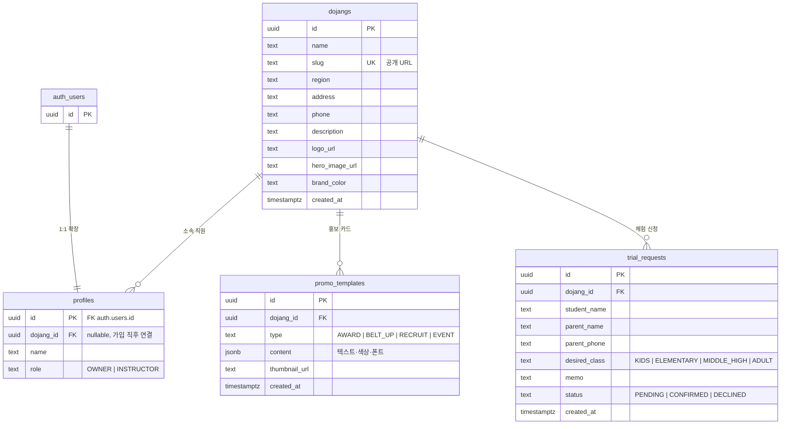
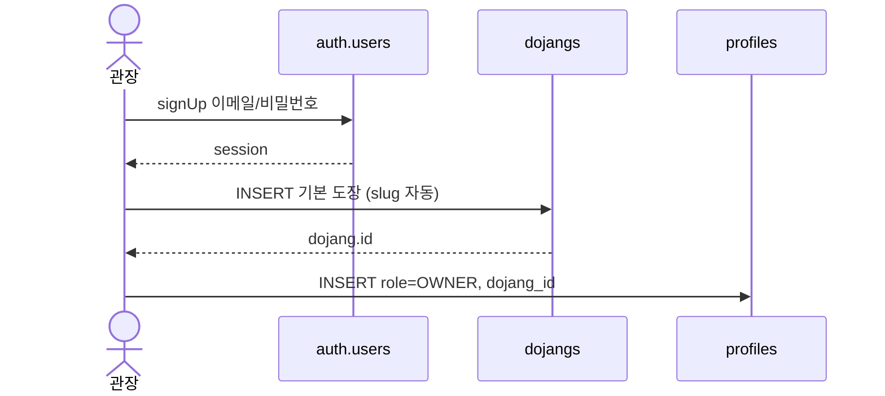

# 데이터 ERD

현재 스키마(`supabase/schema.sql`) 기준입니다.  
도장(`dojangs`)이 중심이고, 직원·홍보 템플릿·체험 신청이 그 아래에 붙습니다.

제품 맥락은 [프로젝트 개요](./프로젝트.md)를 보세요.

---

## ERD

`auth.users`는 Supabase Auth 테이블입니다. 앱 테이블은 `public` 스키마에 있습니다.

---

## 관계

| 관계 | 카디널리티 | ON DELETE | 설명 |
|---|---|---|---|
| `auth.users` → `profiles` | 1:1 | CASCADE | 회원 삭제 시 프로필도 삭제 |
| `dojangs` → `profiles` | 1:N | SET NULL | 도장 삭제 시 직원 소속만 끊김 |
| `dojangs` → `promo_templates` | 1:N | CASCADE | 도장 삭제 시 템플릿 삭제 |
| `dojangs` → `trial_requests` | 1:N | CASCADE | 도장 삭제 시 신청 삭제 |

`profiles.dojang_id`는 가입 직후 도장을 만든 다음에 채우므로 NULL을 허용합니다.

---

## 엔티티

### `dojangs` — 체육관 마스터

공개 랜딩 `/{slug}`의 데이터 소스입니다.

| 컬럼 | 타입 | 제약 | 설명 |
|---|---|---|---|
| id | uuid | PK, `gen_random_uuid()` | |
| name | text | NOT NULL | 도장 이름 |
| slug | text | NOT NULL, UNIQUE | 소문자·숫자·하이픈만 (`^[a-z0-9]+(?:-[a-z0-9]+)*$`) |
| region | text | | 지역 |
| address | text | | 주소 |
| phone | text | | 연락처 |
| description | text | | 소개 |
| logo_url | text | | 로고 (Storage URL 예정) |
| hero_image_url | text | | 대표 사진 |
| brand_color | text | | 랜딩 CSS 변수 |
| created_at | timestamptz | NOT NULL, now() | |

### `profiles` — 직원 프로필

`auth.users` 1:1 확장입니다. `id`는 반드시 `auth.uid()`와 같습니다.

| 컬럼 | 타입 | 제약 | 설명 |
|---|---|---|---|
| id | uuid | PK, FK → `auth.users` | |
| dojang_id | uuid | FK → `dojangs`, NULL 허용 | 소속 도장 |
| name | text | NOT NULL | 표시 이름 |
| role | text | NOT NULL, CHECK | `OWNER` / `INSTRUCTOR` |

인덱스: `profiles_dojang_id_idx`

### `promo_templates` — 홍보 카드 템플릿

랜딩 공개 데이터가 아니라 관장/강사 작업물입니다.

| 컬럼 | 타입 | 제약 | 설명 |
|---|---|---|---|
| id | uuid | PK, `gen_random_uuid()` | |
| dojang_id | uuid | NOT NULL, FK → `dojangs` | |
| type | text | NOT NULL, CHECK | 아래 enum |
| content | jsonb | NOT NULL, default `{}` | 에디터 상태 (제목, 색, 폰트 등) |
| thumbnail_url | text | | 썸네일 |
| created_at | timestamptz | NOT NULL, now() | |

인덱스: `promo_templates_dojang_id_idx`

`content` JSON 형태는 에디터 구현 때 확정합니다. 예정 필드: 제목, 부제목, 본문, 배경색, 폰트 크기/굵기.

### `trial_requests` — 입관 체험 신청

학부모가 넣고, 직원이 처리합니다. Realtime 구독 대상입니다.

| 컬럼 | 타입 | 제약 | 설명 |
|---|---|---|---|
| id | uuid | PK, `gen_random_uuid()` | |
| dojang_id | uuid | NOT NULL, FK → `dojangs` | 어느 도장 신청인지 |
| student_name | text | NOT NULL | 학생 이름 |
| parent_name | text | NOT NULL | 보호자 이름 |
| parent_phone | text | NOT NULL | 연락처 |
| desired_class | text | CHECK, NULL 허용 | 희망 반 |
| memo | text | | 메모 |
| status | text | NOT NULL, default `PENDING`, CHECK | 처리 상태 |
| created_at | timestamptz | NOT NULL, now() | |

인덱스: `trial_requests_dojang_id_idx`, `trial_requests_created_at_idx` (최신순)

---

## Enum (CHECK)

| 컬럼 | 값 |
|---|---|
| `profiles.role` | `OWNER`, `INSTRUCTOR` |
| `promo_templates.type` | `AWARD`, `BELT_UP`, `RECRUIT`, `EVENT` |
| `trial_requests.desired_class` | `KIDS`, `ELEMENTARY`, `MIDDLE_HIGH`, `ADULT` |
| `trial_requests.status` | `PENDING`, `CONFIRMED`, `DECLINED` |

별도 ENUM 타입은 쓰지 않고 CHECK로 막습니다. 앱 코드를 먼저 맞추기 쉽습니다.

---

## RLS

직원 여부는 `is_dojang_staff(dojang_id)`로 봅니다.  
`profiles.id = auth.uid()` 이고 `profiles.dojang_id`가 대상 도장과 같으면 true입니다.

| 테이블 | SELECT | INSERT | UPDATE | DELETE |
|---|---|---|---|---|
| `dojangs` | anon, authenticated 전체 (공개 랜딩) | authenticated (신규 관장 등록) | 소속 직원 | — |
| `profiles` | 본인 행 | 본인 행 (가입) | 본인 행 | — |
| `promo_templates` | 소속 직원 | 소속 직원 | 소속 직원 | 소속 직원 |
| `trial_requests` | 소속 직원 | anon/authenticated. `dojang_id` 필수, `status = PENDING`만 | 소속 직원 | — |

`dojangs` INSERT를 “이미 소속 직원”으로 막으면, 프로필이 없는 신규 관장이 첫 도장을 만들 수 없습니다. 그래서 INSERT만 로그인 사용자에게 열어 두었습니다.

`trial_requests`는 Realtime publication에 들어가 있고, `REPLICA IDENTITY FULL`입니다. 구독도 RLS를 따릅니다. 학부모 연락처는 직원만 보입니다.

---

## 가입 시 데이터 순서

1. Auth 유저 생성  
2. `dojangs` INSERT (이 시점엔 아직 프로필 없음)  
3. `profiles` INSERT (`id = auth.uid()`, `role = OWNER`)

---

## 아직 없는 것

- 반(class) 마스터 — 랜딩에는 유치부·초중고 / 성인 자리만 예정
- Storage 버킷·정책 — `logo_url`, `hero_image_url`은 URL 문자열만 있음
- 강사 초대/합류 — `INSTRUCTOR` 값은 있으나 플로우는 없음
- `promo_templates.content` JSON 스키마 고정

스키마를 바꾸면 이 문서와 `supabase/schema.sql`을 같이 수정합니다.
