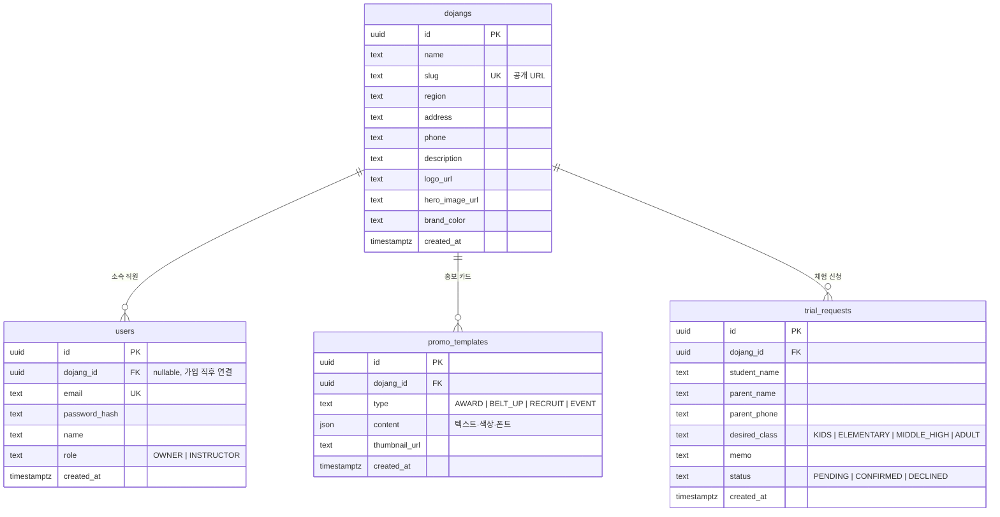
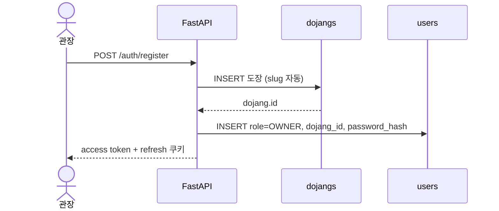

# 데이터 ERD

개발 가이드 v3 기준입니다. DB는 **Neon Postgres**, 스키마는 **SQLAlchemy + Alembic**으로 관리합니다.  
RLS는 쓰지 않고, FastAPI에서 `current_user.dojang_id`로 권한을 막습니다.

제품 맥락은 [프로젝트 개요](./프로젝트.md), 구현 순서는 [개발 가이드 v3](./PUMSAE_개발가이드_v3.md)를 보세요.

---

## ERD

SQLAlchemy 모델 이름은 `User`, `Dojang`, `PromoTemplate`, `TrialRequest`입니다.  
테이블 이름은 스네이크 복수형(`users`, `dojangs`, …)을 씁니다.

---

## 관계

| 관계 | 카디널리티 | ON DELETE | 설명 |
|---|---|---|---|
| `dojangs` → `users` | 1:N | SET NULL | 도장 삭제 시 직원 소속만 끊김 |
| `dojangs` → `promo_templates` | 1:N | CASCADE | 도장 삭제 시 템플릿 삭제 |
| `dojangs` → `trial_requests` | 1:N | CASCADE | 도장 삭제 시 신청 삭제 |

`users.dojang_id`는 가입 직후 도장을 만든 다음에 채우므로 NULL을 허용합니다.

---

## 엔티티

### `dojangs` — 체육관 마스터 (`Dojang`)

공개 랜딩 `/{slug}`의 데이터 소스입니다.

| 컬럼 | 타입 | 제약 | 설명 |
|---|---|---|---|
| id | uuid | PK | |
| name | text | NOT NULL | 도장 이름 |
| slug | text | NOT NULL, UNIQUE | 공개 URL. 한글 이름이면 `dojang` + 랜덤 suffix |
| region | text | | 지역 |
| address | text | | 주소 |
| phone | text | | 연락처 |
| description | text | | 소개 |
| logo_url | text | | R2 public URL |
| hero_image_url | text | | 대표 사진 |
| brand_color | text | | 랜딩 CSS 변수 |
| created_at | timestamptz | NOT NULL, now() | |

### `users` — 계정 (`User`)

자체 인증 테이블입니다. Supabase `auth.users` / `profiles`는 쓰지 않습니다.

| 컬럼 | 타입 | 제약 | 설명 |
|---|---|---|---|
| id | uuid | PK | |
| dojang_id | uuid | FK → `dojangs`, NULL 허용 | 소속 도장 |
| email | text | NOT NULL, UNIQUE | 로그인 ID |
| password_hash | text | NOT NULL | bcrypt |
| name | text | NOT NULL | 표시 이름 |
| role | enum | NOT NULL | `OWNER` / `INSTRUCTOR` |
| created_at | timestamptz | NOT NULL, now() | |

### `promo_templates` — 홍보 카드 (`PromoTemplate`)

관장/강사 작업물입니다. 공개 랜딩 데이터가 아닙니다.

| 컬럼 | 타입 | 제약 | 설명 |
|---|---|---|---|
| id | uuid | PK | |
| dojang_id | uuid | NOT NULL, FK → `dojangs` | |
| type | enum | NOT NULL | 아래 enum |
| content | json | NOT NULL, default `{}` | 에디터 상태 |
| thumbnail_url | text | | 썸네일 |
| created_at | timestamptz | NOT NULL, now() | |

`content`는 프론트 React state와 같은 형태입니다.

| 필드 | 설명 |
|---|---|
| version | `1` |
| type | `AWARD` / `BELT_UP` / `RECRUIT` / `EVENT` |
| layoutId | 레이아웃 프리셋 ID |
| title, subtitle, body | 텍스트 |
| backgroundColor | 배경 hex |
| titleFontSize, subtitleFontSize, bodyFontSize | px |
| titleFontWeight, subtitleFontWeight, bodyFontWeight | 400–800 |
| dojangName | 카드에 찍히는 도장 이름 |

### `trial_requests` — 입관 체험 신청 (`TrialRequest`)

학부모가 넣고, 직원이 처리합니다. 실시간은 FastAPI WebSocket입니다.

| 컬럼 | 타입 | 제약 | 설명 |
|---|---|---|---|
| id | uuid | PK | |
| dojang_id | uuid | NOT NULL, FK → `dojangs` | 어느 도장 신청인지 |
| student_name | text | NOT NULL | 학생 이름 |
| parent_name | text | NOT NULL | 보호자 이름 |
| parent_phone | text | NOT NULL | 연락처 |
| desired_class | enum | NULL 허용 | 희망 반 |
| memo | text | | 메모 |
| status | enum | NOT NULL, default `PENDING` | 처리 상태 |
| created_at | timestamptz | NOT NULL, now() | |

---

## Enum

| 컬럼 | 값 |
|---|---|
| `users.role` | `OWNER`, `INSTRUCTOR` |
| `promo_templates.type` | `AWARD`, `BELT_UP`, `RECRUIT`, `EVENT` |
| `trial_requests.desired_class` | `KIDS`, `ELEMENTARY`, `MIDDLE_HIGH`, `ADULT` |
| `trial_requests.status` | `PENDING`, `CONFIRMED`, `DECLINED` |

---

## 권한 (애플리케이션 레벨)

RLS 대신 FastAPI 의존성으로 막습니다. JWT가 없는 요청은 `get_current_user`에서 401입니다.

| API | 인증 | 규칙 |
|---|---|---|
| `GET /dojangs/{slug}` | 없음 | 공개 랜딩 |
| `POST /trial-requests` | 없음 | 학부모 신청. `status`는 서버가 `PENDING`으로 고정 |
| `POST /auth/register`, `/auth/login`, `/auth/refresh` | 없음 | 토큰 발급 |
| `/dashboard/*` | JWT 필수 | `current_user.dojang_id` ≠ 리소스 `dojang_id` 이면 403 |
| `PATCH /dashboard/dojang` | JWT | `OWNER`만. `INSTRUCTOR`는 403 |
| `POST /uploads/presign` | JWT | 본인 도장 업로드용 URL만 |
| `GET /dashboard/templates/{id}/export` | JWT | 본인 도장 템플릿만 |
| WebSocket `/ws/dashboard/trial-requests` | JWT | 본인 `dojang_id` 방에만 입장 |

---

## 가입 시 데이터 순서

1. `Dojang` INSERT (slug: 영문 이름은 slugify, 한글이면 `dojang` + suffix)  
2. `User` INSERT (`role = OWNER`, `dojang_id` 연결)  
3. JWT 발급

---

## 아직 없는 것

- 반(class) 마스터 — 랜딩에는 유치부·초중고 / 성인 자리만 예정
- 강사 초대/합류 — `INSTRUCTOR` 값은 있으나 플로우는 없음
- Alembic 첫 마이그레이션 — 가이드 v3 3단계에서 생성

모델을 바꾸면 이 문서와 `backend/app/models`를 같이 수정합니다.
