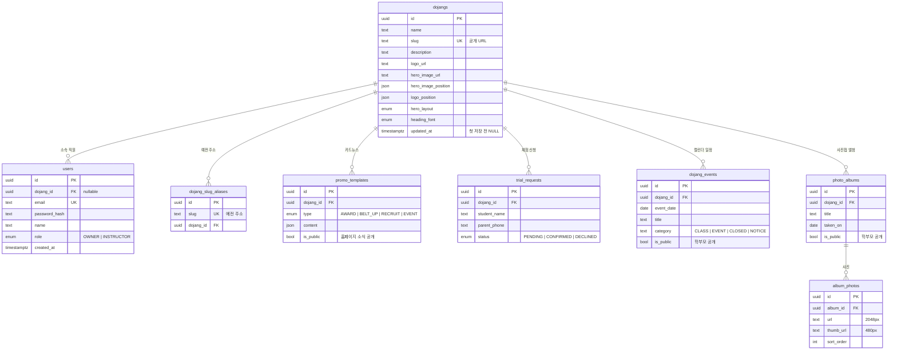
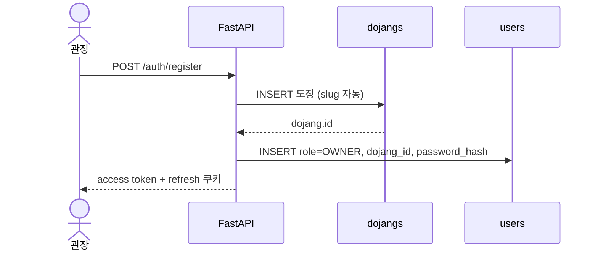

# 데이터 ERD

2026-09-28 기준 실제 스키마입니다. DB는 **Neon Postgres**, 스키마는 **SQLAlchemy + Alembic**으로 관리합니다(마이그레이션 14건, 배포할 때마다 `alembic upgrade head` 자동 실행).  
RLS는 쓰지 않고, FastAPI에서 `current_user.dojang_id`로 권한을 막습니다.

제품 맥락은 [프로젝트 개요](./프로젝트.md)와 [프로젝트 계획서](./PUMSAE_프로젝트_계획서.md), 초기 구현 순서는 [개발 가이드 v3](./PUMSAE_개발가이드_v3.md)를 보세요.

---

## ERD

```mermaid
erDiagram
  dojangs ||--o{ users : "소속 직원"
  dojangs ||--o{ dojang_slug_aliases : "예전 주소"
  dojangs ||--o{ promo_templates : "카드뉴스"
  dojangs ||--o{ trial_requests : "체험 신청"
  dojangs ||--o{ dojang_events : "캘린더 일정"
  dojangs ||--o{ photo_albums : "사진첩 앨범"
  photo_albums ||--o{ album_photos : "사진"

  users {
    uuid id PK
    uuid dojang_id FK "nullable"
    text email UK
    text password_hash
    text name
    enum role "OWNER | INSTRUCTOR"
    timestamptz created_at
  }

  dojangs {
    uuid id PK
    text name
    text slug UK "공개 URL"
    text description
    text logo_url
    text hero_image_url
    json hero_image_position
    json logo_position
    enum hero_layout
    enum heading_font
    timestamptz updated_at "첫 저장 전 NULL"
  }

  dojang_slug_aliases {
    uuid id PK
    text slug UK "예전 주소"
    uuid dojang_id FK
  }

  promo_templates {
    uuid id PK
    uuid dojang_id FK
    enum type "AWARD | BELT_UP | RECRUIT | EVENT"
    json content
    bool is_public "홈페이지 소식 공개"
  }

  trial_requests {
    uuid id PK
    uuid dojang_id FK
    text student_name
    text parent_phone
    enum status "PENDING | CONFIRMED | DECLINED"
  }

  dojang_events {
    uuid id PK
    uuid dojang_id FK
    date event_date
    text title
    text category "CLASS | EVENT | CLOSED | NOTICE"
    bool is_public "학부모 공개"
  }

  photo_albums {
    uuid id PK
    uuid dojang_id FK
    text title
    date taken_on
    bool is_public "학부모 공개"
  }

  album_photos {
    uuid id PK
    uuid album_id FK
    text url "2048px"
    text thumb_url "480px"
    int sort_order
  }
```

그림에는 주요 컬럼만 적었습니다. 전체 컬럼은 아래 [엔티티](#엔티티)를 보세요.

SQLAlchemy 모델은 `User`, `Dojang`, `DojangSlugAlias`, `PromoTemplate`, `TrialRequest`, `DojangEvent`, `PhotoAlbum`, `AlbumPhoto`입니다.  
테이블 이름은 스네이크 복수형(`users`, `dojangs`, …)을 씁니다.

---

## 관계

| 관계 | 카디널리티 | ON DELETE | 설명 |
|---|---|---|---|
| `dojangs` → `users` | 1:N | SET NULL | 도장 삭제 시 직원 소속만 끊김 |
| `dojangs` → `dojang_slug_aliases` | 1:N | CASCADE | 도장 삭제 시 예전 주소 삭제 |
| `dojangs` → `promo_templates` | 1:N | CASCADE | 도장 삭제 시 카드뉴스 삭제 |
| `dojangs` → `trial_requests` | 1:N | CASCADE | 도장 삭제 시 신청 삭제 |
| `dojangs` → `dojang_events` | 1:N | CASCADE | 도장 삭제 시 일정 삭제 |
| `dojangs` → `photo_albums` | 1:N | CASCADE | 도장 삭제 시 앨범 삭제 |
| `photo_albums` → `album_photos` | 1:N | CASCADE | 앨범 삭제 시 사진 행 삭제. API가 R2 파일도 함께 지움 |

`users.dojang_id`는 가입 직후 도장을 만든 다음에 채우므로 NULL을 허용합니다.

---

## 엔티티

### `dojangs` — 체육관 (`Dojang`)

공개 홈페이지 `/{slug}`의 데이터 소스입니다.

| 컬럼 | 타입 | 제약 | 설명 |
|---|---|---|---|
| id | uuid | PK | |
| name | text | NOT NULL | 도장 이름 |
| slug | text | NOT NULL, UNIQUE | 공개 주소. 가입 때 자동(한글 이름이면 `dojang-` + 랜덤), 이후 관장이 직접 변경 가능 |
| region | text | | 지역 |
| address | text | | 주소 |
| phone | text | | 연락처 |
| description | text | | 소개 |
| logo_url | text | | 로고 (R2 공개 URL) |
| hero_image_url | text | | 대표 사진 (R2 공개 URL) |
| hero_image_position | json | | 대표 사진 위치 `{ xPct, yPct, zoom }` (zoom 1–2.5) |
| logo_position | json | | 로고 위치 `{ xPct, yPct, scale }`. 페이지 전체 기준 %, scale 0.5–3. NULL이면 디자인 기본 자리 |
| brand_color | text | | 브랜드 색 `#rrggbb` |
| custom_bg_color | text | | 자유 캔버스 디자인 배경색 |
| custom_text_color | text | | 자유 캔버스 디자인 글자색 |
| section_spacing | text | NOT NULL, default `NORMAL` | `COMPACT` / `NORMAL` / `SPACIOUS` |
| section_text | json | | 섹션 문구 덮어쓰기 `{ key: 문구 }` |
| canvas_elements | json | | 자유 배치 문구 목록 (PC·모바일 위치 따로) |
| hero_layout | enum | NOT NULL, default `GRADIENT` | 디자인 12종 (아래 Enum) |
| heading_font | enum | NOT NULL, default `PRETENDARD` | 제목 글꼴 (아래 Enum) |
| created_at | timestamptz | NOT NULL, now() | |
| updated_at | timestamptz | | 마지막 저장 시각. NULL이면 "미완성"으로 표시 |

### `users` — 계정 (`User`)

자체 인증 테이블입니다.

| 컬럼 | 타입 | 제약 | 설명 |
|---|---|---|---|
| id | uuid | PK | |
| dojang_id | uuid | FK → `dojangs`, NULL 허용 | 소속 도장 |
| email | text | NOT NULL, UNIQUE | 로그인 ID |
| password_hash | text | NOT NULL | bcrypt |
| name | text | NOT NULL | 표시 이름 ("○○님") |
| role | enum | NOT NULL | `OWNER` / `INSTRUCTOR` |
| created_at | timestamptz | NOT NULL, now() | |

### `dojang_slug_aliases` — 예전 주소 (`DojangSlugAlias`)

관장이 페이지 주소를 바꾸면 이전 주소를 여기에 남깁니다. 예전 주소로 들어오면 새 주소로 영구 이동(308)합니다.

| 컬럼 | 타입 | 제약 | 설명 |
|---|---|---|---|
| id | uuid | PK | |
| slug | text | NOT NULL, UNIQUE | 예전 주소. 다른 도장이 새 주소로 쓸 수 없음 |
| dojang_id | uuid | NOT NULL, FK → `dojangs` | |
| created_at | timestamptz | NOT NULL, now() | |

예전에 쓰던 주소로 되돌리면 해당 행은 지워집니다.

### `promo_templates` — 카드뉴스 (`PromoTemplate`)

| 컬럼 | 타입 | 제약 | 설명 |
|---|---|---|---|
| id | uuid | PK | |
| dojang_id | uuid | NOT NULL, FK → `dojangs` | |
| type | enum | NOT NULL | 아래 Enum |
| content | json | NOT NULL, default `{}` | 에디터 상태 |
| thumbnail_url | text | | 카드에 넣은 사진 |
| is_public | boolean | NOT NULL, default `false` | 켜면 공개 홈페이지 "우리 도장 소식"에 표시 |
| created_at | timestamptz | NOT NULL, now() | |

`content`는 프론트 `PromoTemplateContent`와 같은 형태입니다. 공개 홈페이지도 이 값으로 카드를 직접 그립니다(이미지 파일 없음).

| 필드 | 설명 |
|---|---|
| version | `1` |
| type | `AWARD` / `BELT_UP` / `RECRUIT` / `EVENT` |
| layoutId | 레이아웃 프리셋 ID |
| title, subtitle, body | 텍스트 |
| backgroundColor | 배경 hex |
| titleFontSize, subtitleFontSize, bodyFontSize | px |
| titleFontWeight, subtitleFontWeight, bodyFontWeight | 400–800 |
| dojangName | 카드에 찍히는 도장 이름 |
| imageUrl | 카드에 넣은 사진 (http(s) URL 또는 null) |

### `trial_requests` — 입관 체험 신청 (`TrialRequest`)

학부모가 넣고, 직원이 처리합니다. 새 신청은 WebSocket으로 바로 알립니다.

| 컬럼 | 타입 | 제약 | 설명 |
|---|---|---|---|
| id | uuid | PK | |
| dojang_id | uuid | NOT NULL, FK → `dojangs` | 어느 도장 신청인지 |
| student_name | text | NOT NULL | 학생 이름 |
| parent_name | text | NOT NULL | 보호자 이름 |
| parent_phone | text | NOT NULL | 연락처 |
| desired_class | enum | NULL 허용 | 희망 반 |
| memo | text | | 메모 |
| status | enum | NOT NULL, default `PENDING` | 처리 상태 |
| created_at | timestamptz | NOT NULL, now() | |

### `dojang_events` — 캘린더 일정 (`DojangEvent`)

날짜별로 하나씩 등록합니다(반복 일정 없음). `NOTICE`이면서 공개인 일정은 공개 홈페이지 달력 위 "N월 안내"에 메모까지 보입니다.

| 컬럼 | 타입 | 제약 | 설명 |
|---|---|---|---|
| id | uuid | PK | |
| dojang_id | uuid | NOT NULL, FK → `dojangs`, index | |
| event_date | date | NOT NULL, index | 날짜 |
| start_time | varchar(5) | | `HH:MM`. NULL이면 하루 종일 |
| end_time | varchar(5) | | `HH:MM`. 시작보다 빠를 수 없음 |
| title | text | NOT NULL | 1–80자 |
| memo | text | | 최대 1000자 |
| category | varchar(16) | NOT NULL | `CLASS` / `EVENT` / `CLOSED` / `NOTICE` (API에서 검사) |
| is_public | boolean | NOT NULL, default `true` | 끄면 대시보드에서만 보임("관장님만") |
| created_at | timestamptz | NOT NULL, now() | |

### `photo_albums` — 사진첩 앨범 (`PhotoAlbum`)

아이들 사진이 담기므로 **비공개로 시작**합니다.

| 컬럼 | 타입 | 제약 | 설명 |
|---|---|---|---|
| id | uuid | PK | |
| dojang_id | uuid | NOT NULL, FK → `dojangs`, index | |
| title | text | NOT NULL | 1–80자 |
| description | text | | 최대 1000자 |
| taken_on | date | | 찍은 날. 목록은 이 날짜 최신순 |
| is_public | boolean | NOT NULL, default `false` | 켜면 공개 홈페이지 "사진첩"에 표시(사진이 있는 앨범만) |
| created_at | timestamptz | NOT NULL, now() | |

### `album_photos` — 앨범 사진 (`AlbumPhoto`)

업로드할 때 백엔드가 EXIF 회전을 바로잡고 두 크기의 webp로 R2에 저장합니다. 경로는 `albums/{dojang_id}/{album_id}/{uuid}.webp`(+ `-thumb.webp`)입니다.

| 컬럼 | 타입 | 제약 | 설명 |
|---|---|---|---|
| id | uuid | PK | |
| album_id | uuid | NOT NULL, FK → `photo_albums`, index | |
| url | text | NOT NULL | 큰 사진 (긴 변 최대 2048px) |
| thumb_url | text | NOT NULL | 목록용 (긴 변 최대 480px) |
| width | int | NOT NULL | 큰 사진 너비 |
| height | int | NOT NULL | 큰 사진 높이 |
| sort_order | int | NOT NULL, default `0` | 올린 순서. 가장 앞선 사진이 표지 |
| created_at | timestamptz | NOT NULL, now() | |

앨범 하나에 최대 300장입니다.

---

## Enum

| 컬럼 | 값 |
|---|---|
| `users.role` | `OWNER`, `INSTRUCTOR` |
| `dojangs.hero_layout` | `GRADIENT`, `SOLID`, `PHOTO_COVER`, `TRADITIONAL`, `DYNAMIC`, `KIDS`, `PREMIUM`, `OCEAN`, `MONO`, `SPOTLIGHT`, `BADGE`, `CANVAS` |
| `dojangs.heading_font` | `PRETENDARD`, `SONG_MYUNG`, `BLACK_HAN_SANS`, `GOWUN_BATANG`, `GAEGU` |
| `promo_templates.type` | `AWARD`, `BELT_UP`, `RECRUIT`, `EVENT` |
| `trial_requests.desired_class` | `KIDS`, `ELEMENTARY`, `MIDDLE_HIGH`, `ADULT` |
| `trial_requests.status` | `PENDING`, `CONFIRMED`, `DECLINED` |

`dojang_events.category`와 `dojangs.section_spacing`은 DB enum이 아니라 문자열이고, 허용 값은 API에서 검사합니다.

> **알려진 불일치:** 웹 편집기(`types/dojang.ts`)는 제목 글꼴을 10개(`NANUM_MYEONGJO`, `DO_HYEON`, `JUA`, `SUNFLOWER`, `STYLISH` 추가) 보여주지만, DB·API enum은 위 5개뿐입니다. 추가된 5개를 고르면 저장이 거절됩니다.

---

## 권한 (애플리케이션 레벨)

RLS 대신 FastAPI 의존성으로 막습니다.

- `get_current_user`: JWT가 없거나 잘못되면 401.
- `get_staff_user`: 로그인 + 소속 도장이 있어야 함(없으면 403). 관장과 사범 모두 통과합니다.
- 리소스의 `dojang_id`가 `current_user.dojang_id`와 다르면 막습니다. 카드뉴스·체험 신청은 403, 캘린더 일정·앨범은 존재 자체를 숨기려고 404를 돌려줍니다.

| API | 인증 | 규칙 |
|---|---|---|
| `POST /auth/register`, `/auth/login`, `/auth/refresh`, `/auth/logout` | 없음 | 토큰 발급·갱신·로그아웃 |
| `GET /dojangs/{slug}` | 없음 | 공개 홈페이지. 예전 주소도 조회됨 |
| `GET /dojangs/{slug}/news` | 없음 | `is_public` 카드뉴스만 (최신 12개) |
| `GET /dojangs/{slug}/events?from&to` | 없음 | `is_public` 일정만 (최대 62일 범위) |
| `GET /dojangs/{slug}/albums`, `/albums/{id}` | 없음 | `is_public` 앨범만 |
| `POST /trial-requests` | 없음 | 학부모 신청. `status`는 서버가 `PENDING`으로 고정 |
| `GET·PATCH /dashboard/me`, `POST /dashboard/me/password` | JWT | 본인 계정만 |
| `GET·PATCH /dashboard/dojang` | JWT (직원) | 본인 도장만. 관장·사범 모두 수정 가능. 주소 변경 시 중복·예약어 검사 |
| `/dashboard/templates*` | JWT (직원) | 본인 도장 카드뉴스만. `GET …/{id}/export`는 고화질 PNG |
| `/dashboard/events*` | JWT (직원) | 본인 도장 일정만 |
| `/dashboard/albums*` | JWT (직원) | 본인 도장 앨범만. 사진은 한 요청에 한 장 |
| `/dashboard/trial-requests*` | JWT (직원) | 본인 도장 신청만 |
| `POST /uploads` | JWT | 대표 사진·로고용 이미지 업로드(jpg/png/webp, 10MB 이하) |
| WebSocket `/ws/dashboard/trial-requests` | JWT (첫 메시지 `{ token }`) | 본인 `dojang_id` 방에만 입장 |

---

## 가입 시 데이터 순서

```mermaid
sequenceDiagram
  actor Owner as 관장
  participant API as FastAPI
  participant D as dojangs
  participant U as users

  Owner->>API: POST /auth/register
  API->>D: INSERT 도장 (slug 자동)
  D-->>API: dojang.id
  API->>U: INSERT role=OWNER, dojang_id, password_hash
  API-->>Owner: access token + refresh 쿠키
```

1. `Dojang` INSERT (slug: 영문 이름은 slugify, 한글이면 `dojang-` + 랜덤. 다른 도장의 예전 주소와 겹치면 다시 만듦)
2. `User` INSERT (`role = OWNER`, `dojang_id` 연결)
3. JWT 발급 (access는 응답 바디, refresh는 httpOnly 쿠키)

---

## 아직 없는 것

- 사범 초대/합류 — `INSTRUCTOR` 값은 있으나 같은 도장에 들어오는 흐름은 없음
- 반복 일정 — 캘린더는 날짜별 단건만
- 반(class) 마스터 — 홈페이지 수업 안내는 `section_text` 문구로만 관리

모델을 바꾸면 이 문서와 `backend/app/models`를 같이 수정합니다.
