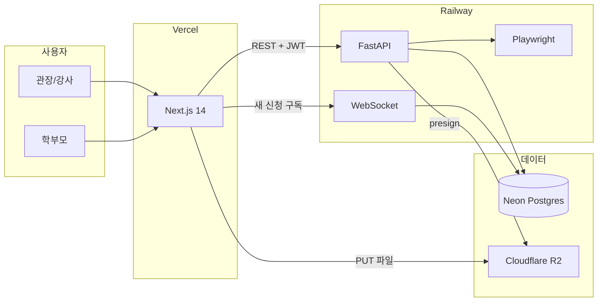

# PUMSAE — 프로젝트 개요

지역 태권도장·체육관이 직접 홍보하고, 체험 신청을 받는 플랫폼입니다.  
디렉토리형 검색 서비스가 아니라 **도장마다 전용 랜딩페이지 + 홍보 카드 + 체험 접수**를 제공합니다.

관련 문서: [문서 목차](./README.md) · [데이터 ERD](./erd.md) · [개발 가이드 v3](./PUMSAE_개발가이드_v3.md)

---

## 무엇을 만드나

관장님이 모바일에서도 바로 쓸 수 있는 세 가지가 핵심입니다.

1. **홍보 랜딩페이지 빌더**  
   이름, 소개, 사진, 브랜드 컬러만 넣으면 `/{slug}` 공개 페이지가 만들어집니다.
2. **인스타/포스터 템플릿 생성기**  
   대회 수상, 띠 승급, 신규 모집, 행사 카드뉴스를 웹에서 편집하고 이미지로 받습니다.
3. **입관 체험 신청 + 실시간 알림**  
   학부모는 로그인 없이 신청하고, 관장님 대시보드에 새 신청이 바로 뜹니다.

---

## 사용자

| 역할 | 설명 |
|---|---|
| 관장 (`OWNER`) | 체육관을 등록하고 랜딩·템플릿·체험 신청을 관리 |
| 강사 (`INSTRUCTOR`) | 같은 도장 소속으로 관리 기능에 참여 (합류 플로우는 이후 확장) |
| 학부모 (비로그인) | 공개 랜딩에서 체험 신청만 함 |

현재 가입은 **“우리 체육관 새로 등록”** 한 가지입니다. 기존 도장에 강사로 합류하는 흐름은 다음 단계에서 붙입니다.

---

## 기술 스택

v2의 Supabase 올인원은 폐기했습니다. 아래가 확정 스택입니다.

| 영역 | 선택 | 이유 |
|---|---|---|
| 프론트 | Next.js 14 App Router, Vercel | 화면·SEO만. DB/R2에 직접 접근하지 않음 |
| 백엔드 | FastAPI, Railway | 인증·CRUD·파일·실시간·고화질 변환 |
| DB | Neon Postgres + SQLAlchemy + Alembic | RLS 대신 API에서 `dojang_id` 권한 검사 |
| 인증 | 자체 JWT (access 메모리, refresh httpOnly 쿠키) | Moneo auth 패턴 |
| 파일 | Cloudflare R2, presigned PUT | 프론트는 백엔드가 준 URL로만 업로드 |
| 실시간 | FastAPI WebSocket | Railway 상시 구동 |
| 빠른 PNG | `html-to-image` (클라이언트) | 에디터에서 바로 저해상도 저장 |
| 고화질 PNG | Playwright (FastAPI 내부) | Vercel 서버리스 용량 제한을 피함 |

설계 기준은 Mobile-First, WYSIWYG Live Preview, 랜딩 SEO입니다.

---

## 지금 어디까지 됐나

가이드 v3 단계 기준입니다. 프론트 UI(가입/랜딩/카드뉴스)는 Next.js에 일부 있지만, 데이터는 아직 Supabase를 보고 있어 **백엔드 이전 전**입니다.

| 단계 | 상태 |
|---|---|
| 2. FastAPI 백엔드 셋업 | 미착수 |
| 3. SQLAlchemy 모델 + Alembic | 미착수 |
| 4. JWT 인증 | 미착수 |
| 5. 프론트 REST 연결 (Supabase 제거) | 미착수 |
| 6. 랜딩페이지 빌더 API 연동 | 프론트 UI만 있음 |
| 7. 템플릿 에디터 + R2 | 에디터 UI만 있음 |
| 8. 고화질 Playwright export | 미착수 |
| 9. 체험 신청 + WebSocket | 미착수 |
| 10. SEO + 동적 OG | 일부 (`generateMetadata`) |
| 11. Vercel + Railway 배포 | 미착수 |

4단계(인증)까지가 새 스택의 뼈대입니다. 회원가입/로그인이 FastAPI로 동작한 뒤에 5단계로 갑니다.

---

## 폴더 구조

```
pumsae/
├── app/                      # Next.js App Router (Vercel)
├── components/
├── lib/                      # 프론트 유틸. API 클라이언트는 lib/api 예정
├── types/
├── backend/                  # FastAPI (Railway) — 예정
│   ├── app/
│   │   ├── api/
│   │   ├── models/
│   │   ├── core/
│   │   └── db/
│   ├── alembic/
│   └── .env.example
├── docs/
│   ├── README.md
│   ├── 프로젝트.md
│   ├── erd.md
│   └── PUMSAE_개발가이드_v3.md
└── .env.example
```

`supabase/` 폴더는 v2 잔여물입니다. 백엔드 이전 때 제거합니다.

프론트 라우트:

| 경로 | 용도 |
|---|---|
| `/register`, `/login` | 관장 인증 |
| `/dashboard/landing` | 랜딩 정보 편집 + Live Preview |
| `/dashboard/templates/new` | 카드뉴스 에디터 |
| `/dashboard/trials` | 체험 신청 목록 + 실시간 알림 |
| `/[slug]` | 공개 홍보 랜딩 |
| `/[slug]/opengraph-image` | 도장별 OG 이미지 |
| `/render/template/[id]` | Playwright가 찍는 순수 렌더 페이지 (예정) |

백엔드 API는 [개발 가이드 v3](./PUMSAE_개발가이드_v3.md)에 단계별로 적혀 있습니다.

---

## 아키텍처



- 프론트는 DB·R2에 직접 붙지 않습니다. 조회/저장은 FastAPI, 파일 업로드만 presigned URL로 R2에 PUT합니다.
- 권한은 RLS가 아니라 `current_user.dojang_id` 검사입니다. 규칙은 [erd.md](./erd.md)를 보세요.

---

## 주요 데이터 흐름

**관장 가입**  
`POST /auth/register` → 비밀번호 해시 → `Dojang` 생성(slug는 이름 기반, 한글이면 `dojang` + suffix) → `User`를 `OWNER`로 생성 → access token은 응답 바디, refresh token은 httpOnly 쿠키.

**랜딩 공개**  
`GET /dojangs/{slug}` (인증 없음). 하단에 체험 신청 CTA.

**체험 신청**  
학부모가 `POST /trial-requests` (`status`는 항상 `PENDING`).  
관장 대시보드는 WebSocket으로 새 신청을 받고 `CONFIRMED` / `DECLINED`로 바꿉니다.

**홍보 카드**  
편집 상태를 JSON으로 들고 있다가 `PromoTemplate.content`에 저장합니다.  
빠른 다운로드는 클라이언트, 고화질은 FastAPI + Playwright입니다.

---

## 환경변수

프론트는 `.env.local`, 백엔드는 `backend/.env`에 둡니다. 값은 각 콘솔에서 받습니다.

| 변수 | 위치 | 용도 |
|---|---|---|
| `NEXT_PUBLIC_API_URL` | 프론트 | Railway FastAPI 주소 |
| `DATABASE_URL` | 백엔드 | Neon Postgres (SSL 필요) |
| `JWT_SECRET` | 백엔드 | access token |
| `JWT_REFRESH_SECRET` | 백엔드 | refresh token |
| `R2_ACCOUNT_ID` | 백엔드 | Cloudflare R2 |
| `R2_ACCESS_KEY_ID` | 백엔드 | R2 키 |
| `R2_SECRET_ACCESS_KEY` | 백엔드 | R2 비밀키 |
| `R2_BUCKET_NAME` | 백엔드 | 버킷 |
| `CORS_ORIGINS` | 백엔드 | Vercel URL + `http://localhost:3000` |

로컬 프론트:

```bash
npm install
copy .env.example .env.local
npm run dev
```

백엔드는 가이드 v3 2단계 이후 `backend`에서 uvicorn으로 띄웁니다. Neon URL은 콘솔에서 받은 뒤 `DATABASE_URL`에 넣습니다.

---

## 앞으로의 우선순위

가이드 순서대로 **백엔드 셋업 → 모델 → JWT 인증**이 먼저입니다.  
인증이 실제로 동작한 다음 프론트에서 Supabase를 떼고 REST로 붙입니다.

시연 임팩트는 템플릿 에디터와 체험 신청 실시간 알림이 큽니다. SEO/OG는 핵심 데모 후에 붙여도 됩니다.
