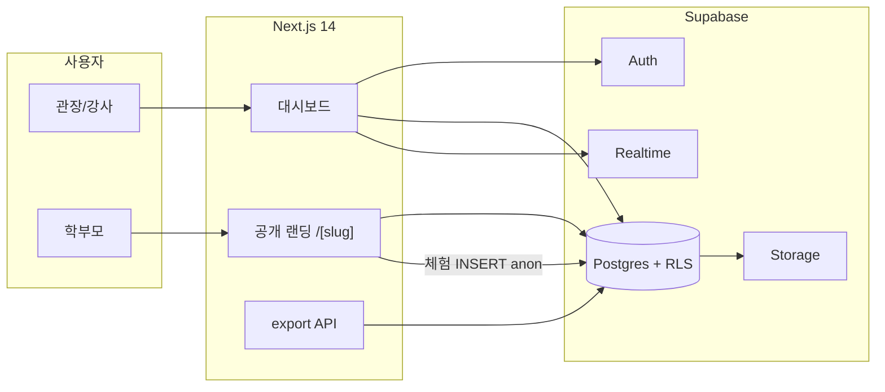

# PUMSAE — 프로젝트 개요

지역 태권도장·체육관이 직접 홍보하고, 체험 신청을 받는 플랫폼입니다.  
디렉토리형 검색 서비스가 아니라 **도장마다 전용 랜딩페이지 + 홍보 카드 + 체험 접수**를 제공합니다.

관련 문서: [데이터 ERD](./erd.md) · [개발 가이드 v2](./태권도장_플랫폼_개발가이드_v2.md) · [스키마 SQL](../supabase/schema.sql)

---

## 무엇을 만드나

관장님이 모바일에서도 바로 쓸 수 있는 세 가지가 핵심입니다.

1. **홍보 랜딩페이지 빌더**  
   이름, 소개, 사진, 브랜드 컬러만 넣으면 `/{slug}` 공개 페이지가 만들어집니다.
2. **인스타/포스터 템플릿 생성기**  
   대회 수상, 띠 승급, 신규 모집, 행사 카드뉴스를 웹에서 편집하고 이미지로 받습니다.
3. **입관 체험 신청 + 실시간 알림**  
   학부모는 로그인 없이 신청하고, 관장님 대시보드에 새 신청이 바로 뜹니다.

---

## 사용자

| 역할 | 설명 |
|---|---|
| 관장 (`OWNER`) | 체육관을 등록하고 랜딩·템플릿·체험 신청을 관리 |
| 강사 (`INSTRUCTOR`) | 같은 도장 소속으로 관리 기능에 참여 (합류 플로우는 이후 확장) |
| 학부모 (비로그인) | 공개 랜딩에서 체험 신청만 함 |

현재 가입은 **“우리 체육관 새로 등록”** 한 가지입니다. 기존 도장에 강사로 합류하는 흐름은 다음 단계에서 붙입니다.

---

## 기술 스택

| 영역 | 선택 | 이유 |
|---|---|---|
| 프론트 | Next.js 14 App Router, TypeScript, Tailwind CSS | 공개 페이지 SSR/SEO + 대시보드를 한 코드베이스에서 |
| 백엔드 | Supabase (Postgres, Auth, Storage, Realtime) | DB·인증·파일·실시간 구독을 한곳에서 |
| 빠른 이미지 저장 | `html-to-image` (예정) | 에디터에서 바로 저해상도 PNG |
| 고화질 PNG/PDF | Vercel Function + `puppeteer-core` + `@sparticuz/chromium` (예정) | 인쇄·SNS용 고해상도 |
| 배포 | Vercel | Next.js와 서버리스 함수에 맞춤 |

설계 기준은 Mobile-First, WYSIWYG Live Preview, 랜딩 SEO입니다.

---

## 지금 어디까지 됐나

| 단계 | 상태 |
|---|---|
| 1. Next.js 셋업 + Supabase 클라이언트 | 완료 |
| 2. 테이블 + RLS SQL | 완료 (`supabase/schema.sql`, SQL Editor에서 실행) |
| 3. 관장 회원가입/로그인 | 미착수 |
| 4. 랜딩페이지 빌더 | 미착수 |
| 5. 템플릿 WYSIWYG 에디터 | 미착수 |
| 6. 고화질 PNG/PDF export | 미착수 |
| 7. 체험 신청 + Realtime 대시보드 | 미착수 |
| 8. SEO + 동적 OG 이미지 | 미착수 |
| 9. Vercel 배포 준비 | 미착수 |

인증·화면은 아직 없고, **앱 뼈대와 데이터 모델**이 준비된 상태입니다.

---

## 폴더 구조

```
pumsae/
├── app/                    # App Router 페이지
├── components/             # 공용 UI
├── lib/
│   └── supabase/
│       ├── client.ts       # 브라우저 / Client Component
│       └── server.ts       # Server Component / Route Handler
├── types/
│   └── env.d.ts            # 환경변수 타입
├── supabase/
│   └── schema.sql          # 테이블 + RLS (SQL Editor용)
├── docs/                   # 프로젝트 문서
└── .env.example
```

예정 라우트:

| 경로 | 용도 |
|---|---|
| `/register`, `/login` | 관장 인증 |
| `/dashboard/landing` | 랜딩 정보 편집 + Live Preview |
| `/dashboard/templates/new` | 카드뉴스 에디터 |
| `/dashboard/trials` | 체험 신청 목록 + 실시간 알림 |
| `/[slug]` | 공개 홍보 랜딩 |
| `/[slug]/opengraph-image` | 도장별 OG 이미지 |
| `/api/templates/[id]/export` | 고화질 PNG/PDF |
| `/render/template/[id]` | puppeteer가 찍는 순수 렌더 페이지 |

---

## 아키텍처



- 브라우저: `lib/supabase/client.ts` (`createBrowserClient`)
- 서버: `lib/supabase/server.ts` (`createServerClient` + cookies)
- `SUPABASE_SERVICE_ROLE_KEY`는 서버 전용. 브라우저 번들에 넣지 않습니다.

데이터 관계와 RLS는 [erd.md](./erd.md)를 보세요.

---

## 주요 데이터 흐름

**관장 가입 (예정)**  
이메일 가입 → `dojangs` 기본 행 생성(slug는 이름 기반, 중복 시 suffix) → `profiles`에 `OWNER`로 연결.

**랜딩 공개**  
`dojangs.slug`로 조회. SELECT는 anon도 가능합니다. 하단에 체험 신청 CTA가 붙습니다.

**체험 신청**  
학부모가 `trial_requests`에 INSERT (`status = PENDING`만 허용).  
관장 대시보드는 Realtime으로 새 행을 받고 `CONFIRMED` / `DECLINED`로 바꿉니다.

**홍보 카드**  
편집 상태를 JSON으로 들고 있다가 `promo_templates.content`에 저장합니다.  
빠른 다운로드는 클라이언트, 고화질은 서버 렌더입니다.

---

## 환경변수

`.env.example`을 `.env.local`로 복사한 뒤 Supabase 콘솔 값을 넣습니다.

| 변수 | 사용처 |
|---|---|
| `NEXT_PUBLIC_SUPABASE_URL` | 클라이언트/서버 공통 |
| `NEXT_PUBLIC_SUPABASE_ANON_KEY` | 브라우저 포함. RLS가 권한을 막음 |
| `SUPABASE_SERVICE_ROLE_KEY` | 서버 전용. RLS를 우회하므로 노출 금지 |

로컬 실행:

```bash
npm install
copy .env.example .env.local
npm run dev
```

DB는 콘솔에서 프로젝트를 만든 다음 `supabase/schema.sql`을 SQL Editor에 실행합니다.

---

## 앞으로의 우선순위

시연 임팩트 기준으로는 **템플릿 WYSIWYG 에디터**와 **체험 신청 실시간 알림**이 먼저입니다.  
SEO/OG는 핵심 데모 후에 붙여도 됩니다.

강사 합류, 반(class) 마스터 데이터, Storage 버킷 정책은 아직 스키마에 없습니다. 필요해지면 ERD와 SQL을 같이 올립니다.
