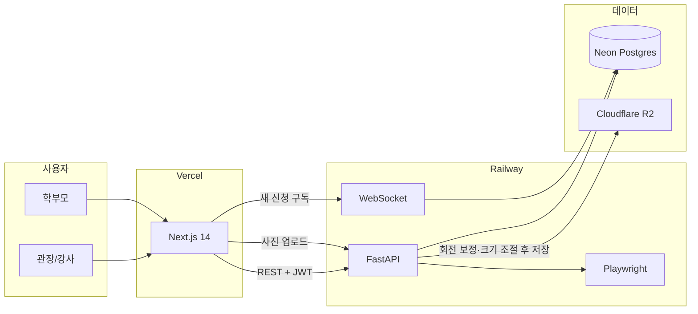

# PUMSAE — 프로젝트 개요

지역 태권도장·체육관이 직접 홍보하고, 체험 신청을 받는 플랫폼입니다.  
디렉토리형 검색 서비스가 아니라 **도장마다 전용 랜딩페이지 + 홍보 카드 + 체험 접수**를 제공합니다.

관련 문서: [데이터 ERD](./erd.md) · [개발 가이드 v3](./PUMSAE_개발가이드_v3.md) · [프로젝트 계획서](./PUMSAE_프로젝트_계획서.md)

---

## 무엇을 만드나

관장님이 모바일에서도 바로 쓸 수 있는 세 가지가 핵심입니다.

1. **홍보 랜딩페이지 빌더**  
   이름, 소개, 사진, 브랜드 컬러만 넣으면 `/{slug}` 공개 페이지가 만들어집니다.
2. **인스타/포스터 템플릿 생성기**  
   대회 수상, 띠 승급, 신규 모집, 행사 카드뉴스를 웹에서 편집하고 이미지로 받습니다.
3. **입관 체험 신청 + 실시간 알림**  
   학부모는 로그인 없이 신청하고, 관장님 대시보드에 새 신청이 바로 뜹니다.

---

## 사용자

| 역할 | 설명 |
|---|---|
| 관장 (`OWNER`) | 체육관을 등록하고 랜딩·템플릿·체험 신청을 관리 |
| 강사 (`INSTRUCTOR`) | 같은 도장 소속으로 관리 기능에 참여 (합류 플로우는 이후 확장) |
| 학부모 (비로그인) | 공개 랜딩에서 체험 신청만 함 |

현재 가입은 **“우리 체육관 새로 등록”** 한 가지입니다. 기존 도장에 강사로 합류하는 흐름은 다음 단계에서 붙입니다.

---

## 기술 스택

v2의 Supabase 올인원은 폐기했습니다. 아래가 확정 스택입니다.

| 영역 | 선택 | 이유 |
|---|---|---|
| 프론트 | Next.js 14 App Router, Vercel | 화면·SEO만. DB/R2에 직접 접근하지 않음 |
| 백엔드 | FastAPI, Railway | 인증·CRUD·파일·실시간·고화질 변환 |
| DB | Neon Postgres + SQLAlchemy + Alembic | RLS 대신 API에서 `dojang_id` 권한 검사 |
| 인증 | 자체 JWT (access 메모리, refresh httpOnly 쿠키) | Moneo auth 패턴 |
| 파일 | Cloudflare R2 | 프론트·앱은 파일을 백엔드로 보내고, 백엔드가 회전 보정·크기 조절 후 R2에 저장 |
| 실시간 | FastAPI WebSocket | Railway 상시 구동 |
| 빠른 PNG | `html-to-image` (클라이언트) | 에디터에서 바로 저해상도 저장 |
| 고화질 PNG | Playwright (FastAPI 내부) | Vercel 서버리스 용량 제한을 피함 |

설계 기준은 Mobile-First, WYSIWYG Live Preview, 랜딩 SEO입니다.

---

## 지금 어디까지 됐나

2026-09-28 기준입니다. 가이드 v3의 단계는 모두 끝났고, 웹·앱·서버가 운영 배포 중입니다. 기능별 자세한 현황과 추진 일정은 [프로젝트 계획서](./PUMSAE_프로젝트_계획서.md)에 있습니다.

| 단계 | 상태 |
|---|---|
| 2. FastAPI 백엔드 셋업 | 완료 |
| 3. SQLAlchemy 모델 + Alembic | 완료 (배포 시 자동 마이그레이션) |
| 4. JWT 인증 | 완료 (로그아웃 전까지 로그인 유지) |
| 5. 프론트 REST 연결 (Supabase 제거) | 완료 |
| 6. 랜딩페이지 빌더 API 연동 | 완료 (디자인 12종, 내 페이지 주소) |
| 7. 템플릿 에디터 + R2 | 완료 |
| 8. 고화질 Playwright export | 완료 |
| 9. 체험 신청 + WebSocket | 완료 |
| 10. SEO + 동적 OG | 완료 (`generateMetadata`, 도장별 OG 이미지) |
| 11. Vercel + Railway 배포 | 완료 |

가이드 이후에 추가한 기능:

| 기능 | 상태 |
|---|---|
| 모바일 앱 (Flutter) | 완료 (내 작업물, 캘린더, 사진첩, 카드뉴스, 체험 신청, 프로필) |
| 내 작업물 (대시보드 홈) | 완료 |
| 우리 도장 소식 (카드뉴스 공개) | 완료 |
| 캘린더 (수업·행사·휴관·공지, 월간 안내) | 완료 |
| 사진첩 (앨범, 비공개로 시작) | 완료 |
| 사범 초대 · 내부 공지사항 | 예정 |

---

## 폴더 구조

```
pumsae/
├── app/                      # Next.js App Router (Vercel)
├── components/               # 화면 부품 (landing, hero-layouts, calendar, albums, templates, dashboard …)
├── lib/                      # 프론트 유틸. API 클라이언트는 lib/api
├── types/
├── backend/                  # FastAPI (Railway, Docker)
│   ├── app/
│   │   ├── api/              # auth, dashboard, dojangs, events, albums, trials, uploads, ws
│   │   ├── models/
│   │   ├── core/
│   │   ├── db/
│   │   └── promo/            # 카드뉴스 고화질 렌더링(HTML → Playwright)
│   ├── alembic/              # 배포할 때마다 자동으로 upgrade head
│   └── .env.example
├── pumsae_app/               # Flutter 모바일 앱 (Android/iOS)
├── docs/
│   ├── 프로젝트.md
│   ├── erd.md
│   ├── PUMSAE_개발가이드_v3.md
│   ├── PUMSAE_프로젝트_계획서.md
│   ├── 배포.md               # Vercel·Railway·앱 배포, 환경변수, 마이그레이션
│   └── images/               # README 화면 캡처 (예시 데이터)
└── .env.example
```

프론트 라우트:

| 경로 | 용도 |
|---|---|
| `/` | 서비스 홈 (기능 소개, "이렇게 만들어져요" 예시) |
| `/register`, `/login` | 회원가입(체육관 함께 생성), 로그인 |
| `/profile` | 프로필 (이름·비밀번호 변경, 로그아웃). 대시보드와 분리 |
| `/dashboard` | 내 작업물 (홈페이지·카드뉴스·체험 신청 요약) |
| `/dashboard/landing` | 랜딩페이지 편집기 + 실시간 미리보기 |
| `/dashboard/templates`, `/dashboard/templates/new`, `/dashboard/templates/[id]` | 카드뉴스 목록(홈페이지 공개 스위치), 새로 만들기, 편집 |
| `/dashboard/albums`, `/dashboard/albums/[id]` | 사진첩 앨범 목록, 앨범(사진 올리기·공개 설정) |
| `/dashboard/calendar` | 캘린더 (수업·행사·휴관·공지) |
| `/dashboard/trials` | 체험 신청 목록 + 실시간 알림 |
| `/dashboard/profile` | 예전 주소. `/profile`로 이동 |
| `/[slug]` | 공개 홈페이지 (읽기 전용). 예전 주소로 오면 새 주소로 영구 이동 |
| `/[slug]/opengraph-image` | 도장별 OG 이미지 |

카드뉴스 고화질 PNG는 프론트 렌더 페이지 없이, 백엔드가 `backend/app/promo`에서 HTML을 만들어 Playwright로 찍습니다.

백엔드 API는 [개발 가이드 v3](./PUMSAE_개발가이드_v3.md)에 단계별로 적혀 있습니다.

---

## 아키텍처


```mermaid
flowchart LR
  subgraph clients [사용자]
    Owner[관장/강사]
    Parent[학부모]
  end

  subgraph vercel [Vercel]
    Next[Next.js 14]
  end

  subgraph railway [Railway]
    API[FastAPI]
    WS[WebSocket]
    PW[Playwright]
  end

  subgraph data [데이터]
    Neon[(Neon Postgres)]
    R2[Cloudflare R2]
  end

  Owner --> Next
  Parent --> Next
  Next -->|"REST + JWT"| API
  Next -->|"새 신청 구독"| WS
  API --> Neon
  Next -->|"사진 업로드"| API
  API -->|"회전 보정·크기 조절 후 저장"| R2
  API --> PW
  WS --> Neon
```

- 프론트는 DB·R2에 직접 붙지 않습니다. 조회/저장과 파일 업로드 모두 FastAPI를 거칩니다. 사진은 백엔드가 받아 회전 정보를 바로잡고 크기를 줄인 뒤 R2에 저장합니다.
- 권한은 RLS가 아니라 `current_user.dojang_id` 검사입니다. 규칙은 [erd.md](./erd.md)를 보세요.

---

## 주요 데이터 흐름

**관장 가입**  
`POST /auth/register` → 비밀번호 해시 → `Dojang` 생성(slug는 이름 기반, 한글이면 `dojang` + suffix) → `User`를 `OWNER`로 생성 → access token은 응답 바디, refresh token은 httpOnly 쿠키.

**랜딩 공개**  
`GET /dojangs/{slug}` (인증 없음). 하단에 체험 신청 CTA.

**체험 신청**  
학부모가 `POST /trial-requests` (`status`는 항상 `PENDING`).  
관장 대시보드는 WebSocket으로 새 신청을 받고 `CONFIRMED` / `DECLINED`로 바꿉니다.

**홍보 카드**  
편집 상태를 JSON으로 들고 있다가 `PromoTemplate.content`에 저장합니다.  
빠른 다운로드는 클라이언트, 고화질은 FastAPI + Playwright입니다.

---

## 환경변수

프론트는 `.env.local`, 백엔드는 `backend/.env`에 둡니다. 값은 각 콘솔에서 받습니다.

| 변수 | 위치 | 용도 |
|---|---|---|
| `NEXT_PUBLIC_API_URL` | 프론트 | Railway FastAPI 주소 |
| `DATABASE_URL` | 백엔드 | Neon Postgres (SSL 필요) |
| `JWT_SECRET` | 백엔드 | access token |
| `JWT_REFRESH_SECRET` | 백엔드 | refresh token |
| `R2_ACCOUNT_ID` | 백엔드 | Cloudflare R2 |
| `R2_ACCESS_KEY_ID` | 백엔드 | R2 키 |
| `R2_SECRET_ACCESS_KEY` | 백엔드 | R2 비밀키 |
| `R2_BUCKET_NAME` | 백엔드 | 버킷 |
| `CORS_ORIGINS` | 백엔드 | Vercel URL + `http://localhost:3000` |

로컬 프론트:

```bash
npm install
copy .env.example .env.local
npm run dev
```

백엔드는 가이드 v3 2단계 이후 `backend`에서 uvicorn으로 띄웁니다. Neon URL은 콘솔에서 받은 뒤 `DATABASE_URL`에 넣습니다.

---

## 앞으로의 우선순위

다음은 **사범 초대**입니다. 사범이 같은 도장에 합류해야 내부 공지사항과 "관장님만" 일정을 함께 쓸 수 있습니다.  
그다음 카카오톡 공유, 앱 스토어 배포 순서로 봅니다. 전체 목록과 우선순위는 [프로젝트 계획서 10장](./PUMSAE_프로젝트_계획서.md#10-향후-계획)에 있습니다.
